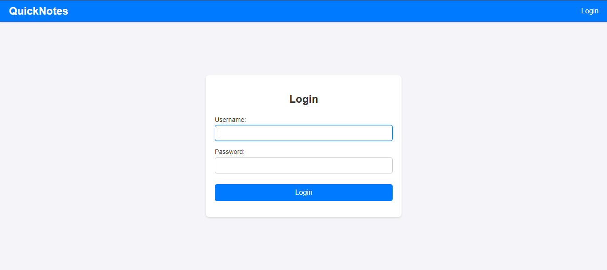
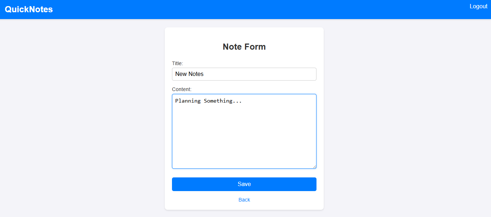
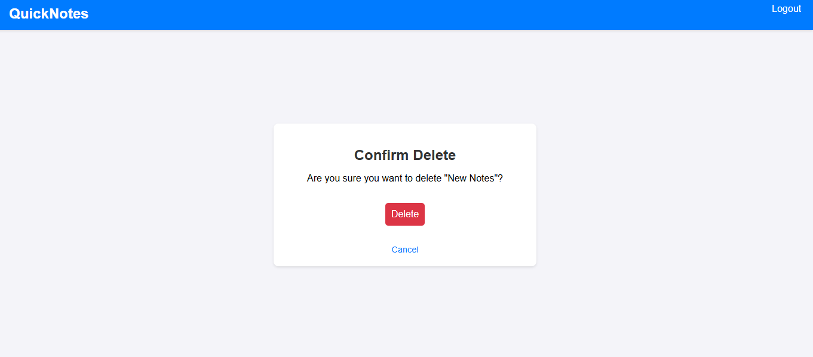

# QuickNote: A Django-Powered Note-Taking Web App

## 🌟 Overview
**QuickNote** is a lightweight web app built with Django that lets users securely create, edit, view, and delete personal notes — just like a digital notebook! It's responsive, beginner-friendly, and perfect for organizing your ideas.

## 🚀 Features

### 🔐 User Authentication
- Secure **login** and **logout** system.

### 📝 Note Management
- **Create** new notes with a title and content.
- **View** your personal notes list.
- **Edit** existing notes.
- **Delete** notes with confirmation to avoid mistakes.

### 🔒 Private Notes
- Notes are accessible **only** to the user who created them.

### 📱 Responsive Design
- Works smoothly on both **desktops** and **mobile devices**.

### 🎨 Clean Interface
- Minimalist UI with **blue & white** tones.
- Consistent **QuickNotes header** on every page.

## 📸 Screenshots:

- **Login Page**: Enter your credentials to access notes.  
  

- **Home Page**: Lists your notes with edit/delete options.  
  

- **Create/Edit Note**: Add or update notes.  
  

- **Delete Confirmation**: Avoid accidental deletions.  
  

- **Admin Page**: Admin Login Page.  
  

## 🛠 Technologies Used

### 🎨 Frontend
- **HTML/CSS**: Page structure and styling.
- **Django Templates**: Dynamic rendering and layout inheritance.

### 🧠 Backend
- **Django**: Framework handling authentication and logic.
- **Python**: Core backend language.

### 💾 Database
- **SQLite**: Lightweight DB for storing notes and users.
- **Django ORM**: Manages database operations.

## ⚙️ Prerequisites

- Python 3.8+
- pip
- Git

## 📥 Setup Instructions

```bash
# Clone the Repository
git clone https://github.com/AnowarOHossain/Quick-Note.git
cd Quick-Note

# Create Virtual Environment
python -m venv venv
# Activate (Linux/macOS)
source venv/bin/activate
# Activate (Windows)
venv\Scripts\activate

# Install Dependencies
pip install django

# Apply Migrations
python manage.py migrate

# Create Superuser
python manage.py createsuperuser

# Run Development Server
python manage.py runserver  

- Visit: `http://127.0.0.1:8000/`
- Admin: `http://127.0.0.1:8000/admin/`

## 🗂 Project Structure

QuickNote/
├── quicknote/              
│   ├── settings.py
│   ├── urls.py
├── notes/                   
│   ├── migrations/
│   ├── templates/
│   │   ├── notes/
│   │   │   ├── base.html
│   │   │   ├── home.html
│   │   │   ├── note_form.html
│   │   │   ├── confirm_delete.html
│   ├── templates/registration/
│   │   ├── login.html
│   │   ├── logged_out.html
│   ├── models.py
│   ├── views.py
│   ├── forms.py
│   ├── urls.py
├── screenshots/             
├── manage.py
└── README.md

## 🧠 Django Concepts Used

- **Models**: `Note` model
- **Views**: Home, create, update, delete functions
- **Templates**: Rendering pages dynamically
- **URL Routing**: Navigation and user actions
- **Authentication**: Secure login/logout
- **Forms**: `NoteForm` for user input
- **Decorators**: `@login_required` for security
- **Template Inheritance**: Common layout via `base.html`
- **CSRF Protection**: `` for secure forms

## 🐞 Known Issues

- **Logout 405 Error**: Sometimes logout triggers a GET instead of POST. Fix in progress using POST method in logout form.

## 🤝 Contributing

### Steps:
1. **Fork** the repository.
2. **Create a branch**: `git checkout -b feature-name`
3. **Make changes & commit**: `git commit -m "Your message"`
4. **Push** to GitHub: `git push origin feature-name`
5. **Open a Pull Request`

**Guidelines**:
- Keep code clean and readable.
- Test before submitting.
- Add meaningful commit messages.

## 🌱 Future Improvements

- Add **search** functionality.
- Enable **note categorization**.
- Style using **Bootstrap** or **Tailwind CSS**.
- **Deploy** to Heroku or PythonAnywhere.

## 📜 License

This project is under the **MIT License**. See `LICENSE` file for more info.

## 📬 Contact

Email: **anowarhossain.dev@gmail.com**  
GitHub: [Open an Issue](https://github.com/AnowarOHossain/Quick-Note/issues)